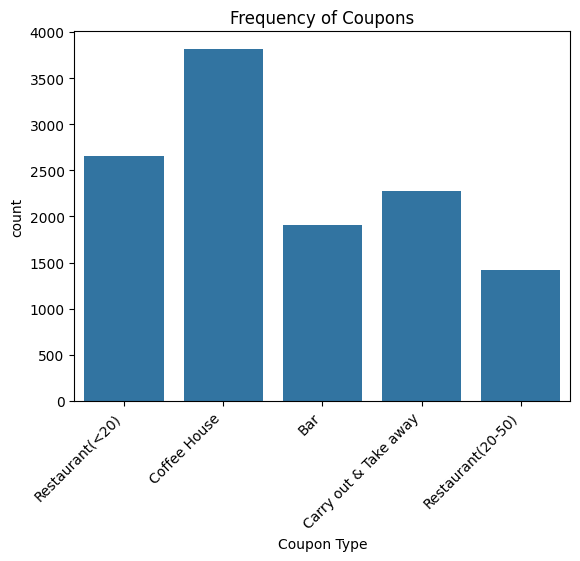
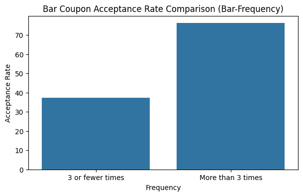
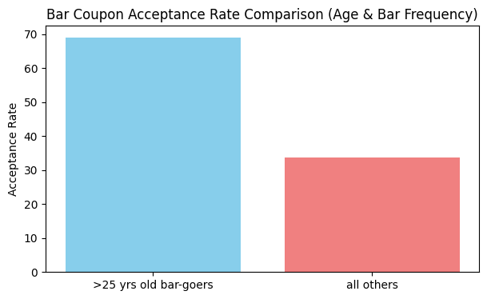
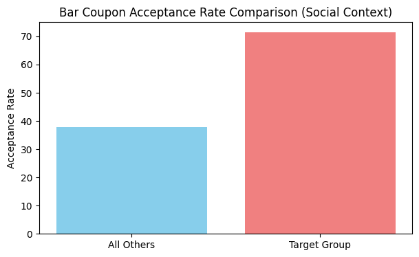
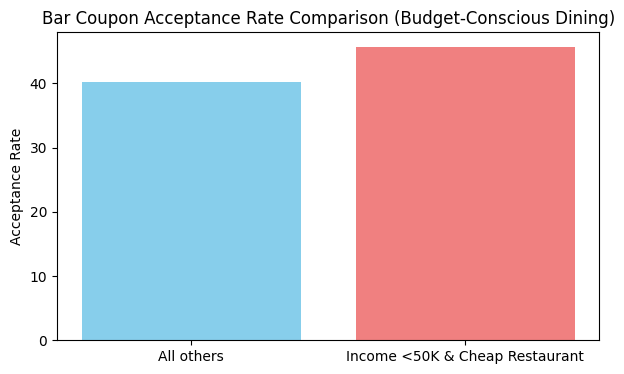
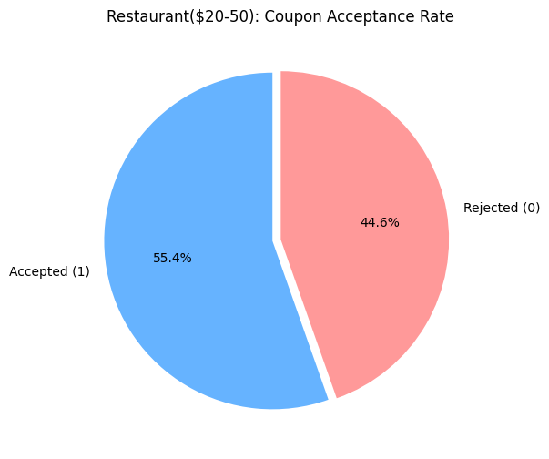
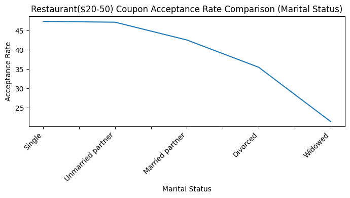
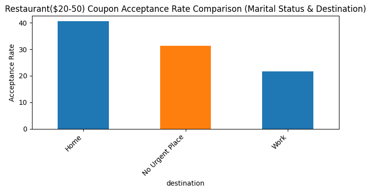
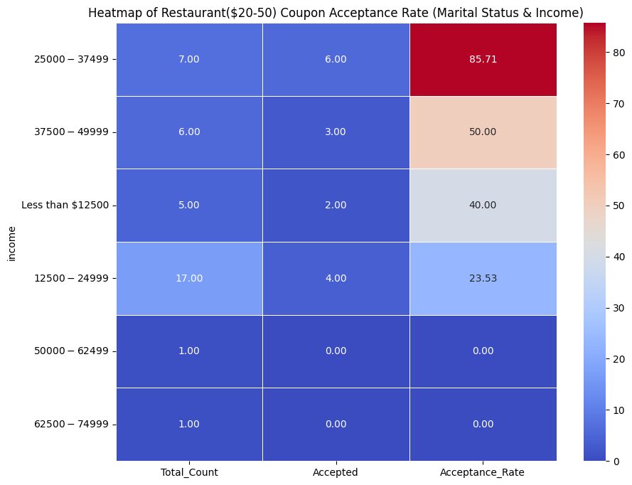

🚗 Customer Coupon Acceptance Analysis

This project explores the factors that influence whether a driver will accept a mobile coupon for a nearby business. Using data from the UCI Machine Learning repository, the analysis distinguishes between customers who accepted a coupon ('Y=1') and those who did not ('Y=0') based on situational, demographic, and behavioral attributes.

📌 Project Overview
The goal is to move beyond simple proximity and understand the behavioral and contextual drivers of coupon conversion. Key questions explored include:
Are frequent bar-goers more likely to accept a bar coupon even with passengers?
How do specific marital and income groups behave when heading home?

🛠️ Technologies Used
Python 3.x
Pandas & NumPy: For advanced data cleaning and multi-conditional aggregation.
Matplotlib & Seaborn: For statistical visualizations, including distribution plots, bar charts, and heatmaps.

🗂️ Data Cleaning & Strategy
"Results and decision making that emanate from statistical analysis can only be as good as the quality of the data". Following this principle, the following steps were taken:
    Handling Extreme Sparsity: The car column was missing ~99% of its data. These were filled with "Unknown" to preserve the rows for other analyses.
    The 5% Rule: For other critical columns like CoffeeHouse and Bar, missing values represented only +1% of the total dataset. Following industry rule-of-thumb, these rows were deleted as the sample size reduction was negligible.
    Standardization: Categorical visit frequencies (e.g., '1-3', 'less1') were mapped into logical groups for comparative analysis.

📊 Key Findings

1. General Trends
Overall Acceptance: Approximately 56.93% of all offered coupons were accepted.
Coupon Volume: "Coffee House" and "Cheap Restaurant" coupons were the most frequently offered in the dataset.

2. The "Bar Coupon" Deep-Dive
Frequency as a Predictor: Drivers who visit bars more than 3 times a month accept coupons at twice the rate of those who visit 3 times or fewer.

Age & Habits: Drivers over 25 who visit bars at least once a month show a markedly higher acceptance rate compared to the general population.

Social Influence: The "Target Group"—drivers with non-child passengers (friends/partners) who are frequent bar-goers—represents one of the most likely segments to accept a bar coupon.

Low-Income Frequent Diners: 
The final phase of the analysis focused on the Cheap Restaurant segment
The "Frequent Value" Group: Drivers who visit inexpensive restaurants (RestaurantLessThan20) more than 4 times a month.
Income Impact: Analysis was specifically filtered for drivers with an income less than $50,000.
Insight: This demographic shows a high propensity for coupon usage, suggesting that financial constraints combined with established dining habits are strong predictors for coupon redemption in the value-dining category.

3. Mid-Range Dining: Restaurant(20-50):
Mid-Range Restaurant coupons is another category of coupons we would like to analyze among drivers.
Overall Acceptance: Approximately 55% of all offered coupons were accepted.

Restaurant(20-50) Segment & Marital Context: Analysis of mid-range dining revealed that Divorced and Widowed drivers often have the lowest acceptance rates.

We want to explore data of this group of divorcers and widowers to see which factors would maximize the acceptance rate of mid-range restaurant coupons among this group. We found following 2 trends that can help us increase the coupon acceptance rate among this group:

The "Heading Home" Effect: Within the Divorced/Widowed group, those heading Home were more likely to accept a coupon than those heading elsewhere, suggesting a preference for convenience during their evening commute.

Income Heatmap: For the "Lonely/Heading Home" cluster, we utilized a Seaborn Heatmap to visualize how income levels influence acceptance, identifying specific wealth brackets that are more price-sensitive or value-driven for mid-range dining. We discover that divorcers/widowers with income in the range of 25K - 37.5K per year who are heading home have an extremely high rate of coupon acceptance. 6 out 7 coupons offered to them are accepted, which yields an acceptance rate of 85%. That is surprisingly high rate.

🚀 Usage
Clone the repository:
bash
git clone https://github.com/neilbyte/coupons
Use code with caution.

Dependencies:
bash
pip install pandas numpy matplotlib seaborn
Use code with caution.

Run: 
To run the analysis:
Clone the repo.
Place coupons.csv in the data/ folder.
Execute the Jupyter Notebook coupon_prompt.ipynb to view the full analysis and generated plots.

📈 Visualizations
The analysis includes:
Frequency Plots: Breakdown of coupon types offered.
Acceptance Distributions: Pie charts for category-specific conversion.
Behavioral Comparisons: Bar graphs comparing high-frequency vs. low-frequency users.
Heatmaps: Correlation between income levels and marital status for specific dining segments.

🎯 Strategic Marketing Recommendations
Based on the patterns identified in this analysis, a marketing team should prioritize the following strategies to maximize coupon conversion:

1. Prioritize Behavioral Frequency over Demographics
The data shows that past behavior is the strongest predictor of future acceptance.
Action: Target "High-Frequency" users (those who visit bars or cheap restaurants >3 times a month) with higher-value coupons. These users have an acceptance rate twice as high as the general population, offering the best ROI for marketing spend.

2. Leverage Social Context for Bar Coupons
Acceptance rates for bar coupons spike when drivers are with Friends or Partners, but drop significantly when children are present.
Action: Use real-time mobile data to trigger "Bar" coupons only when the "Passenger" sensor or app-logic indicates a social group is present. Avoid sending bar-related notifications to drivers identified as traveling with family/children.

3. Optimize Mid-Range Dining for the "Homebound" Commute
For Restaurant(20-50) coupons, the "Heading Home" destination was a significant driver of acceptance for specific demographics like Divorced or Widowed users, especially those with the income between the range of 25K - 37K per year. 
Action: Time these mid-range restaurant offers for the evening commute (4 PM – 7 PM). Position the messaging around "convenience on the way home" or "taking the night off from cooking" to appeal to these high-conversion segments.

GitHub directory:
https://github.com/neilbyte/coupons